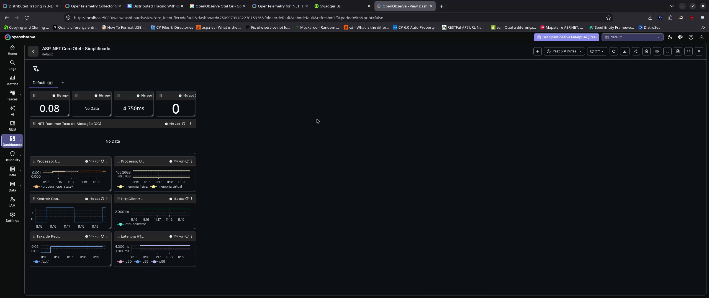
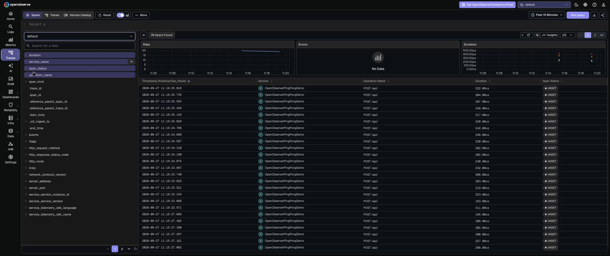
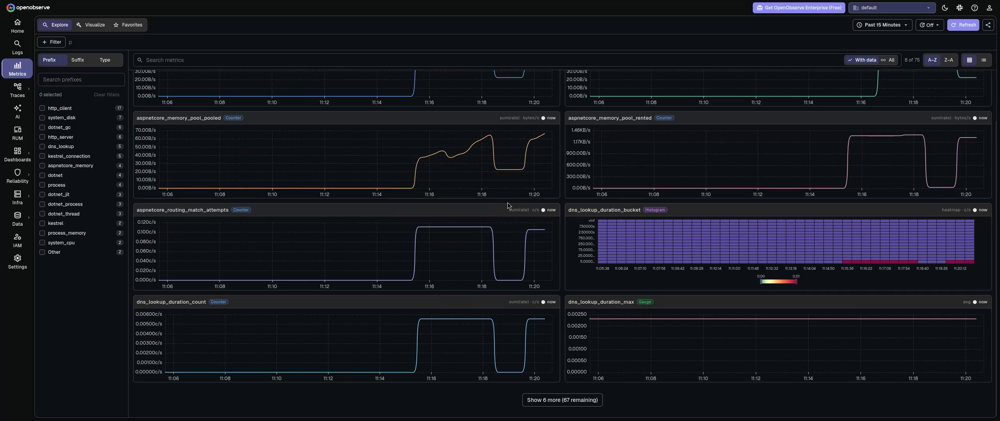

# OpenObserverPingPongDemo

Aplicação de demonstração em ASP.NET Core no formato Ping-Pong, criada para praticar a integração da instrumentação do OpenTelemetry (OTel) com o backend de observabilidade OpenObserve.

## Objetivo

Demonstrar o fluxo completo de observabilidade (Traces, Metrics e Logs) enviado de uma aplicação .NET para o OpenObserve via OpenTelemetry Collector.

## Arquitetura resumida

1. **ASP.NET Core API (`OpenObserverPingPongDemo`)**: endpoint simples de Ping-Pong (`POST` com `{"play": "ping"}` retorna `"pong"`).
2. **OpenTelemetry Collector**: recebe os dados de telemetria da aplicação .NET via protocolo OTLP (gRPC/HTTP) e exporta para o OpenObserve.
3. **OpenObserve**: armazena, correlaciona e visualiza os logs, traces e métricas do ecossistema.

## Configuração do arquivo `.env` (token Base64 do OpenObserve)

Para que a aplicação ou o OTel Collector consigam se autenticar no OpenObserve, é necessário obter o header de autenticação Base64.

Passo a passo:

1. Acesse o painel do OpenObserve.
2. No menu lateral, navegue até **Ingestion** (ou **Data Sources**).
3. Selecione a opção **OpenTelemetry** (ou **Custom / HTTP Ingestion**).
4. Copie a credencial exibida em `Basic Auth` (ou monte usando o padrão `base64(usuario:senha_ou_token)`).
5. Crie um arquivo `.env` na raiz do projeto com o exemplo abaixo:

```env
OPENOBSERVE_ENDPOINT=http://localhost:5080/api/default/
OPENOBSERVE_AUTH_BASE64=dXNlckBleGFtcGxlLmNvbTpwYXNzd29yZA==
OTEL_EXPORTER_OTLP_ENDPOINT=http://localhost:4317
```

## Como executar o projeto

1. Iniciar o OpenObserve e o OTel Collector (via Docker Compose ou serviços locais):
   ```bash
   docker-compose up -d
   ```

2. Executar a API ASP.NET Core:
   ```bash
   dotnet run --project OpenObserverPingPongDemo
   ```

3. Enviar uma requisição de teste via Swagger (`http://localhost:5080/swagger` ou porta configurada):
   - **Endpoint**: `POST /api`
   - **Body**:
     ```json
     {
       "play": "ping"
     }
     ```
   - **Resposta esperada**: `"pong"`

## Como importar o dashboard no OpenObserve

O projeto disponibiliza um painel pré-configurado com métricas do .NET Runtime (CPU, memória, Garbage Collection e taxa de requisições HTTP).

Passo a passo para importar o `aspnetcore-otel-dashboard-simplificado.json`:

1. Faça login no painel do OpenObserve.
2. No menu lateral, clique em **Dashboards**.
3. Clique em **Import** (ou **New Dashboard** > **Import JSON**).
4. Selecione ou cole o conteúdo do arquivo `aspnetcore-otel-dashboard-simplificado.json` localizado no repositório.
5. Confirme a importação. O painel "ASP .NET Core Otel - Simplificado" estará pronto para uso.

## Telas no OpenObserve

### Dashboard

Visão consolidada de requisições, latência, alocação de memória e coletas de GC do runtime .NET:



### Traces

Rastreamento distribuído das requisições enviadas ao serviço `OpenObserverPingPongDemo`, com duração, status e detalhes de cada span da chamada `POST /api`:



### Metrics

Explorador de métricas do OpenTelemetry em tempo real (`aspnetcore_memory_pool_pooled`, `dns_lookup_duration_bucket`, etc.):



## Referências

- [OpenObserve - .NET OpenTelemetry Guide](https://openobserve.ai/opentelemetry/dotnet/)
- [OpenObserve - OpenTelemetry Collector Configuration](https://openobserve.ai/opentelemetry/collector/)
